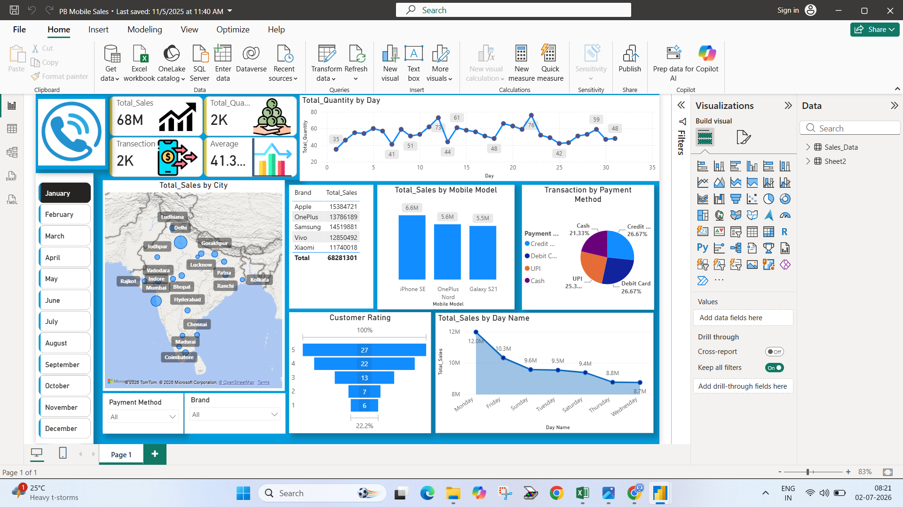

# PB Mobile Sales Dashboard

## Overview
Interactive Power BI dashboard analyzing mobile brand sales performance across India for 2025.

## Dashboard Preview

## Key Features
- **Total Sales Analysis**: Brand-wise performance for Apple, Samsung, OnePlus, Vivo, Xiaomi
- **Geographic Insights**: City-wise breakdown highlighting Delhi, Mumbai, Lucknow as top markets  
- **Payment Trends**: UPI, Debit Card, Credit Card, Cash analysis
- **Customer Ratings**: 1-5 scale satisfaction tracking

## Tools & Technologies
- Power BI Desktop
- DAX for custom measures: Total Sales, YoY Growth, Top City
- Power Query for data cleaning & transformation
- Data Modeling with relationships

## Key Insights
- Delhi contributed 28% of total revenue
- UPI emerged as dominant payment mode with 42% share
- Automated reporting reduced manual effort by 90%

## Files
- `PB_Mobile_Sales.pdf` - Full dashboard report
- `Dashboard_Screenshot.png` - Dashboard preview
